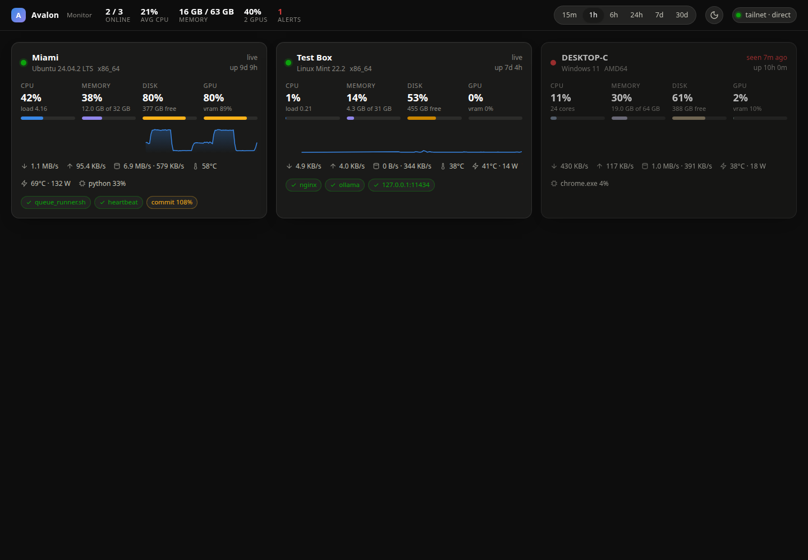
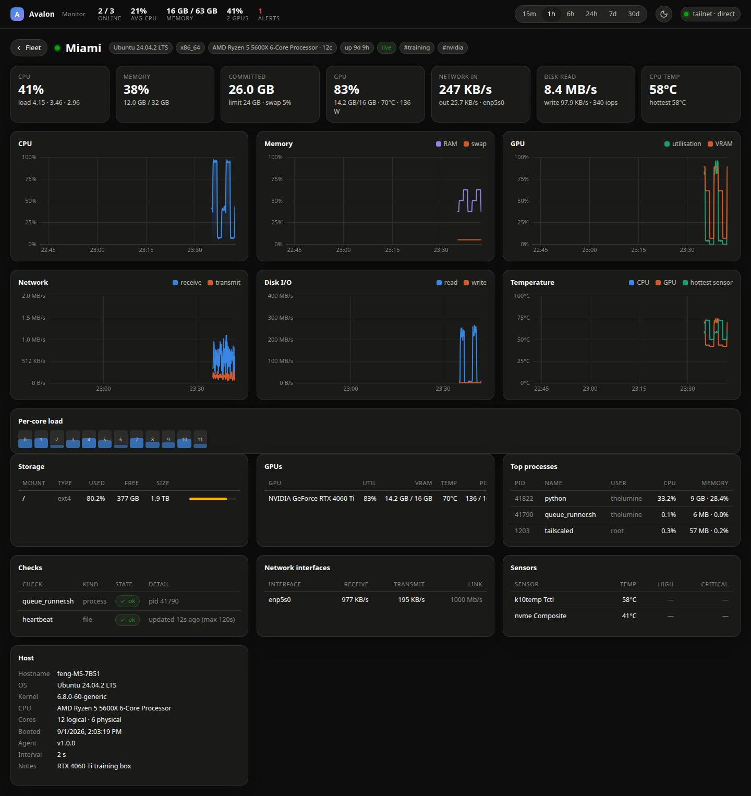

# Avalon Monitor

A self-hosted system-resource hub for the whole fleet — CPU, memory, disks,
disk I/O, network, GPUs, temperatures, top processes and custom liveness checks
from every machine, live on one page.

* **Hub** runs on AVALON (Ubuntu/Mint): FastAPI + SQLite, WebSocket live feed,
  7 days of raw samples + 90 days of 1-minute rollups by default.
* **Agents** are a single Python file that runs on Linux (x86 & ARM/Raspberry Pi),
  Windows and macOS, and push over **Tailscale** with a per-host token.
* **Dashboard** is published at `https://monitor.avalontech.xyz` through the
  existing Cloudflare Tunnel and locked behind **Cloudflare Access**; the hub
  independently verifies the Access token on every request.




```
┌──────────────┐  ┌──────────────┐  ┌──────────────┐  ┌──────────────┐
│ miami (linux)│  │desktop-c (win)│  │ rpi5 (arm64) │  │ laptop (win) │   avalon_agent.py
└──────┬───────┘  └──────┬───────┘  └──────┬───────┘  └──────┬───────┘   (psutil + nvidia-smi /
       └───────── Tailscale ─── POST /api/v1/ingest (bearer token) ──────┘    rocm-smi / sysfs / LHM)
                                        │
                              ┌─────────▼──────────┐
                              │  AVALON  :8787      │  FastAPI · SQLite (WAL) · rollups
                              │  avalon-monitor     │  WebSocket fan-out · Access JWT check
                              └─────────┬──────────┘
                     cloudflared tunnel │ (localhost only)
                              ┌─────────▼──────────┐
                              │  Cloudflare Access │  → https://monitor.avalontech.xyz
                              └────────────────────┘
```

## Repository layout

| Path | What |
|------|------|
| `server/avalon_monitor/` | hub: `main.py` (API/WS), `db.py` (storage), `auth.py` (Access + tokens), `static/` (dashboard) |
| `server/manage.py` | enroll / list / disable / remove hosts, rotate tokens |
| `agent/avalon_agent.py` | the agent (only dependency: `psutil`) |
| `agent/install/` | `install-linux.sh` (root or `--user`) + systemd unit, `install-windows.ps1` (Scheduled Task) |
| `deploy/` | hub systemd unit, `install-server.sh`, cloudflared ingress snippet |
| `docs/CLOUDFLARE.md` | step-by-step tunnel + Access setup |
| `docs/HOSTS.md` | ready-to-paste `agent.conf` per machine (Miami, DESKTOP-C, AVALON, Pi) |

## 1. Install the hub on AVALON

```bash
git clone <this repo> ~/Projects/System_Monitor && cd ~/Projects/System_Monitor
sudo ./deploy/install-server.sh
```

That creates the `avalon-monitor` system user, a venv in `/opt/avalon-monitor`,
the DB in `/var/lib/avalon-monitor`, config in `/etc/avalon-monitor/monitor.env`,
and starts `avalon-monitor.service`. The dashboard is immediately reachable
on the tailnet at `http://<avalon-tailscale-ip>:8787/` (no login needed from
the tailnet; everything else is refused).

Re-run the installer after `git pull` to upgrade.

### Run from the checkout instead (development)

```bash
cd server && python3 -m venv .venv && .venv/bin/pip install -r requirements.txt psutil
cp .env.example .env            # edit as needed; AVM_DB_PATH=data/monitor.db is fine
.venv/bin/python manage.py add-host avalon
.venv/bin/python -m avalon_monitor.main
```

## 2. Enroll a machine and install its agent

On AVALON, one command per machine (the token is shown once):

```bash
avalon-monitor-manage add-host miami --display "Miami" --notes "RTX 4060 Ti training box"
```

Then on the machine — copy the `agent/` folder over (scp, git, USB…) and:

**Linux / Raspberry Pi**

```bash
sudo ./install/install-linux.sh --server http://avalon:8787 --token avm_… 
# later: sudo ./install/install-linux.sh --upgrade
```

**Windows** (elevated PowerShell)

```powershell
Set-ExecutionPolicy -Scope Process Bypass
.\install\install-windows.ps1 -Server http://avalon:8787 -Token avm_…
```

`http://avalon:8787` works when MagicDNS is on; otherwise use the tailnet IP
(`100.123.17.92`). The agent never talks to the public hostname.

**AVALON itself** can run the agent too:
`sudo ./agent/install/install-linux.sh --server http://127.0.0.1:8787 --token …`.

### Agent options (`/etc/avalon-agent/agent.conf`, `%ProgramData%\AvalonAgent\agent.conf`)

```ini
AVM_INTERVAL=5                      # seconds between samples
AVM_PROCESSES=8                     # top-N processes by CPU
AVM_TAGS=gpu,training               # shown as chips on the host page
AVM_WATCH_PROCESSES=queue_runner.sh # process alive?  (name or cmdline substring)
AVM_WATCH_FILES=/srv/queue/heartbeat:120   # file touched within N seconds?
AVM_WATCH_TCP=127.0.0.1:11434       # port open?
AVM_WATCH_MOUNTS=/run/media/feng/Data          # volume still mounted?
AVM_WATCH_CONTENT=/srv/queue/current.txt       # show a file's first line (e.g. the running job)
AVM_WATCH_MARKERS=/srv/queue/*.failed          # globs that must match nothing (crash markers)
AVM_WATCH_NONEMPTY=/srv/queue/queue.txt        # warn when a queue file is empty
AVM_WATCH_MARKERS=~/markers/*.done::rc=(?!0\b)  # ...or only files whose content matches a regex
AVM_WATCH_UNITS=user:xrsec-queue.service       # systemd unit state (system: | user: | user@NAME:)
AVM_WATCH_JOBS=user:xrsec-*.scope              # active scopes = "a job is running" (drives the GPU-stall rule)
AVM_MEM_AVAILABLE_WARN_GB=8                    # amber when MemAvailable drops below this
AVM_LHM_URL=http://localhost:8085/data.json  # Windows: LibreHardwareMonitor for temps / AMD-Intel GPUs
```

Checks show up as green/red (or amber for warnings) chips on the fleet card
and count toward the "alerts" figure in the header. The hub adds one derived
check of its own: **gpu stalled** fires when a host has had a job scope active
for `AVM_RULE_GPU_STALL_MINUTES` (10) while GPU utilisation never exceeded
`AVM_RULE_GPU_STALL_PERCENT` (5) — the "healthy-looking 30× slowdown" case — handy for "is the queue runner still alive"
style questions that raw CPU/GPU numbers don't answer.

GPU sources, in order: `nvidia-smi` (Linux & Windows), amdgpu `sysfs`
(Linux, no ROCm needed; falls back to `rocm-smi` when the card is power-gated),
LibreHardwareMonitor (Windows). Because a job can be data-loader-bound while the
GPU idles, the host page shows per-process CPU right beside GPU utilisation,
and the fleet card shows the busiest process.

### Upgrading later — agents update themselves

Agents (1.2+) compare the SHA-256 of their own script with the one the hub
serves in every report reply. When you upgrade the hub
(`git pull && sudo ./deploy/install-server.sh`), each agent downloads the new
`avalon_agent.py` on its next report, verifies the hash, checks it compiles,
replaces itself atomically and re-execs — the whole fleet converges within
one interval, with no per-machine steps and no inbound ports. Check with
`avalon-monitor-manage agents`; pause fleet-wide with
`AVM_AGENT_AUTO_UPDATE=false` on the hub or per host with
`AVM_AUTO_UPDATE=false` in its `agent.conf`. A script that fails the hash or
syntax check is never installed. The download uses the same token and
tailnet-only rules as ingest (Tailscale encrypts the hop).

Checks can be edited from the dashboard (host page → **Checks**) and a
**Respawn agent** button re-execs an agent in place; both ride the same reply
channel.

## 3. Publish it at `monitor.avalontech.xyz`

Follow [docs/CLOUDFLARE.md](docs/CLOUDFLARE.md): one ingress rule in
`/etc/cloudflared/config.yml`, one Access application, two lines in
`monitor.env`. Until Access is configured the hub refuses anything arriving
through the tunnel, so the order of those steps doesn't matter.

## API (all under `/api/v1`, viewer auth required except `ingest`)

| Method | Path | |
|--------|------|-|
| `POST` | `/ingest` | agent payload, `Authorization: Bearer avm_…`; tailnet only |
| `GET`  | `/hosts` | fleet list with per-host summaries and online status |
| `GET`  | `/hosts/{name}` | latest full sample |
| `GET`  | `/hosts/{name}/series?metrics=cpu,mem&range=6h&points=600` | bucketed history (`15m…30d`) |
| `WS`   | `/live` | snapshot on connect, then a `host` message per sample / status change |
| `GET`  | `/config`, `/stats`, `/healthz` | |

Metrics: `cpu load1 cpu_temp mem swap disk_read disk_write net_rx net_tx gpu_util gpu_mem gpu_temp temp_max disk_used`.

## Operations

```bash
avalon-monitor-manage list-hosts            # last-seen, source IP
avalon-monitor-manage rotate-token miami    # then update that agent's config
avalon-monitor-manage disable laptop-c      # keep history, refuse pushes
avalon-monitor-manage stats                 # row counts, DB size
journalctl -u avalon-monitor -f
```

Retention is tunable with `AVM_RETENTION_RAW_HOURS` / `AVM_RETENTION_1M_DAYS`;
a host is shown offline after `AVM_OFFLINE_AFTER_SEC` (30 s) without a sample.
The DB is a single file (`/var/lib/avalon-monitor/monitor.db`) — back it up
with `sqlite3 monitor.db ".backup /path/backup.db"`.
